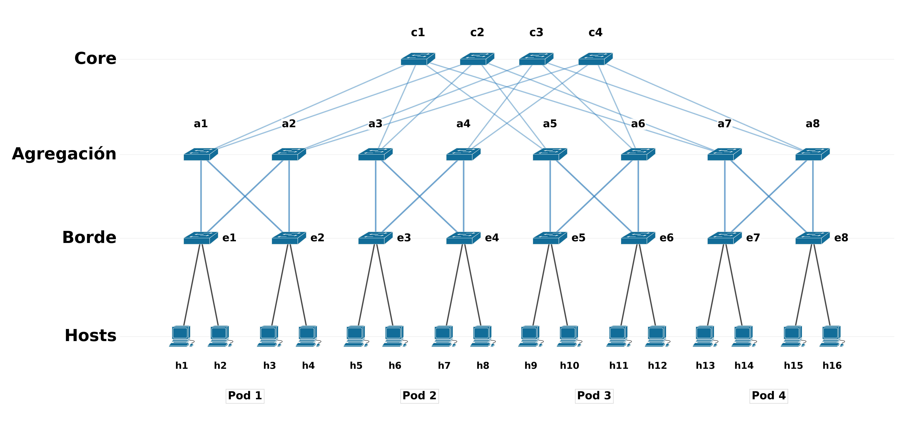

# SDN Fat-Tree Testbed

Reproducible academic SDN testbed for incremental validation of data-center network topologies using **Mininet**, **Open vSwitch**, **OpenFlow 1.3** and **OpenDaylight**.

This repository is a curated, public-facing version of the software and compact evidence developed for the bachelor's thesis **“Implementación SDN de Arquitecturas Fat-Tree Multidimensional”** at Universidad Miguel Hernández (2026). The thesis was defended with a grade of **10/10** and received **Matrícula de Honor**.

> **Scope boundary:** the primary validated Fat-Tree campaign uses deterministic RESTCONF forwarding. ECMP is demonstrated in a bounded `select`-group scope. A broader/full-ECMP attempt is retained only as exploratory, non-conclusive engineering evidence.



*Fat-Tree k=4 topology used in the validated testbed: 4 core, 8 aggregation and 8 edge switches, with 16 hosts across 4 pods.*

## What this repository demonstrates

- Progressive validation from basic and intermediate topologies to Leaf-Spine and a **Fat-Tree k=4**.
- Deterministic generation of a k-ary Fat-Tree topology and metadata.
- OpenDaylight RESTCONF flow installation with Open vSwitch datapath verification.
- Controlled Leaf-Spine forwarding comparisons.
- Point-to-point, concurrent and hotspot Fat-Tree traffic scenarios.
- A bounded ECMP demonstrator using OpenFlow `select` groups and branch counters.
- Reproducibility snapshots and compact processed evidence.

## Fat-Tree k=4

The final topology contains:

- 4 core switches
- 8 aggregation switches
- 8 edge switches
- 16 hosts
- 20 OpenFlow switches in total
- 48 links

Deterministic node, link, host and port metadata is included in `data/topology/fattree_k4/`.

## Selected evidence

The compact CSVs in `data/results/` support the public claims without publishing thousands of machine-specific raw logs.

### Leaf-Spine

The principal `single_path` versus ECMP comparison produced mean aggregate throughput of approximately **95.44 Mbit/s** and **191.14 Mbit/s**, respectively. On `lf1`, the single-path profile concentrated traffic on one uplink, whereas ECMP used both uplinks at approximately 96% mean utilization in the controlled experiment.

### Deterministic Fat-Tree RESTCONF campaign

All recorded campaign blocks passed their configured checks: flow installation (84/84), preflight (6/6), point-to-point (9/9), concurrent distributed (12/12) and hotspot (12/12).

### Limited ECMP

The `select_group` demonstrator recorded traffic on both observed branches, with approximately 57.7% / 42.3% forward share in the captured experiment.

See [`docs/results.md`](docs/results.md) for the exact evidence and [`docs/limitations.md`](docs/limitations.md) for claim boundaries.

## Repository structure

```text
sdn-fattree-testbed/
├── tfg_sdn/                 # Python package: CLI, topologies, ODL/OVS helpers, experiments
├── examples/flows/          # compact OpenFlow payload examples
├── data/topology/           # deterministic k=4 topology metadata
├── data/results/            # selected processed evidence
├── figures/                 # regenerated public-facing result plots
├── tools/                   # plotting and portable release-audit utilities
├── docs/                    # architecture, methodology, reproducibility, results, limitations
└── tests/                   # portable smoke/unit tests
```

## Quick start

The original work was executed on **native Ubuntu/Linux**. Mininet and Open vSwitch are system dependencies.

```bash
python3 -m venv .venv
source .venv/bin/activate
python -m pip install -e '.[plots,test]'
```

Configure the local OpenDaylight laboratory credentials outside Git:

```bash
export ODL_HOST=127.0.0.1
export ODL_REST_PORT=8181
export ODL_OF_PORT=6653
export ODL_USER=admin
export ODL_PASS='your-local-lab-password'
```

Run a reproducibility snapshot:

```bash
tfgctl doctor
```

Export Fat-Tree k=4 metadata without starting Mininet:

```bash
python -m tfg_sdn.mininet.topos.fattree --k 4 --export --outdir data/topology/fattree_k4_generated
```

Generate the compact public figures:

```bash
python tools/plot_public_results.py
```

More setup details are in [`docs/reproducibility.md`](docs/reproducibility.md). The exact thesis-era reference stack is recorded in [`docs/environment.md`](docs/environment.md), and the experiment-script dependency/status map is in [`docs/script_catalog.md`](docs/script_catalog.md).

## Experimental scope

The repository preserves three evidence levels:

1. **Primary:** deterministic RESTCONF forwarding on the k=4 Fat-Tree.
2. **Bounded extension:** limited ECMP / OpenFlow `select` groups.
3. **Exploratory:** attempt toward broader Fat-Tree ECMP; useful for engineering traceability, but not a validated full-ECMP result.

## Academic context

Author: **Fernando Tomás Gámez Cartagena**  
Degree: Grado en Ingeniería de Tecnologías de Telecomunicación  
University: Universidad Miguel Hernández de Elche (EPSE)  
Bachelor's thesis: *Implementación SDN de Arquitecturas Fat-Tree Multidimensional*  
Defense: June 2026

## Release status

**v1.0.0 is the first validated public release.** The tagged snapshot completed native-Linux functional validation and public-release checks, including anonymous clone and byte-reconciliation verification. The release includes the validated ZIP artifact and matching SHA-256 checksum. The current rights policy is documented in [`docs/rights_and_reuse.md`](docs/rights_and_reuse.md).

## Rights and reuse

No open-source license is granted by this repository or its releases. Copyright © 2026 Fernando Tomás Gámez Cartagena. All rights reserved unless a file explicitly states otherwise. See [`docs/rights_and_reuse.md`](docs/rights_and_reuse.md).
